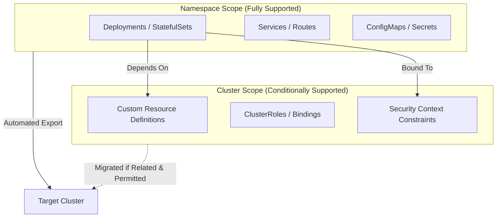

# Crane Compatibility Matrix: Namespace vs. Cluster Resources

> **Note to Users:** Crane is primarily a namespace-scoped migration tool. However, it can migrate cluster-scoped resources if they are explicitly related to the namespace workload and the migration context has sufficient RBAC permissions.

---
 TEST
## 1. Executive Summary
This document defines the operational boundaries of **Crane**. Migration success depends on two factors:
1. **Functional Relevance:** Is the cluster resource strictly required by the namespace workload?
2. **Permission Context:** Does the migration service account have the required RBAC to "get" and "create" these cluster-scoped objects?

---

## 2. Resource Support Visualization
The following diagram illustrates how Crane treats different resource layers based on their relationship to the application.

---

## 3. Detailed Compatibility Matrix

### 3.1 Namespace-Scoped Resources (Fully Supported)
These resources are the core of any migration and are moved automatically.
* **Workloads:** Deployment, DeploymentConfig, StatefulSet, DaemonSet, Job, CronJob.
* **Networking:** Service, Route, Ingress, Endpoints.
* **Config & Secrets:** ConfigMap, Secret, ServiceAccount.
* **Storage:** PersistentVolumeClaim (PVC).

### 3.2 Cluster-Scoped Resources (Conditionally Supported)
These resources are migrated **only if they are linked to the namespace workload** and the execution context has appropriate permissions.

* **Definitions (CRDs):** Migrated if the namespace contains Custom Resources (CRs) that depend on these definitions.
* **Global Security (ClusterRole/Binding):** Migrated if specifically referenced by a ServiceAccount within the migrating namespace.
* **Security Context Constraints (SCCs):** Migrated if the application requires specific localized SCCs to run (common in OpenShift environments).
* **Quota & Limits:** ResourceQuotas and LimitRanges are migrated if they are defined specifically for the source namespace.

### 3.3 Infrastructure Resources (Manual/Environmental)
These are generally not migrated as they represent the physical or cloud provider environment.
* **Nodes & MachineConfigs:** Environment-specific hardware configurations.
* **StorageClasses:** These must be mapped to the destination's available storage providers.
* **Operator Controllers:** While the *Operands* (the apps) move, the *Operators* (the managers) must be pre-installed on the target.

---

## 4. Permission & Context Requirements
For "Conditionally Supported" resources to migrate successfully, the following must be true:
* **Sufficient RBAC:** The migration user/service account must have cluster-wide `get`, `list`, and `create` permissions for the specific cluster-scoped types.
* **Owner References:** Crane looks for functional links (e.g., a ServiceAccount tied to a ClusterRole) to determine what "related" infrastructure needs to move.

---

## 5. Pre-Migration Checklist
* [ ] **RBAC Audit:** Ensure the migration identity has permissions to access related ClusterRoles and SCCs.
* [ ] **Storage Mapping:** Confirm that destination StorageClasses are ready to receive moved PVCs.
* [ ] **Operator Readiness:** All required Operators are installed via OperatorHub on the target cluster.
* [ ] **CRD Check:** Verify if any global CRDs need to be manually applied to the target to avoid "orphan" resources.

---
